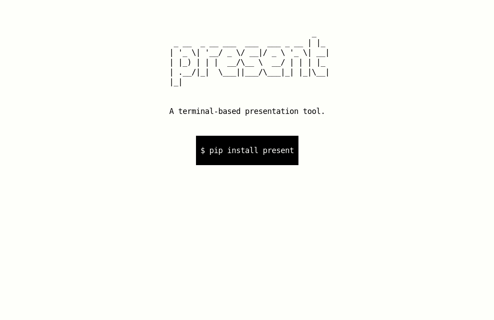
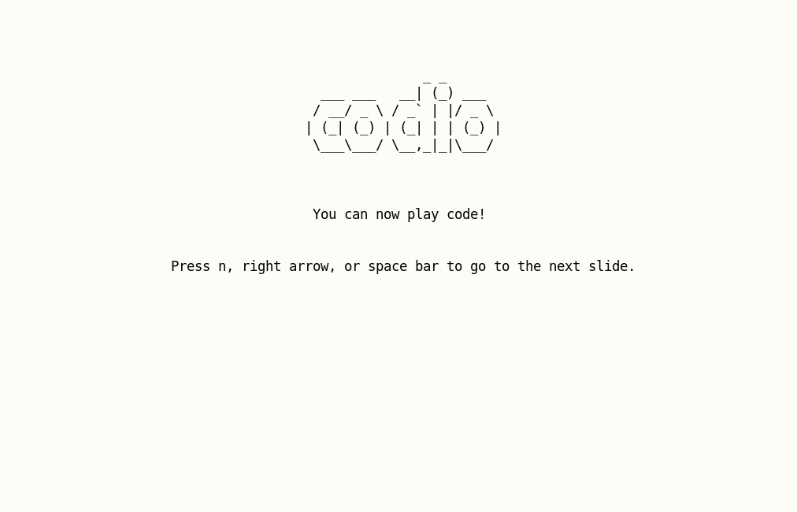

.. present documentation master file, created by
   sphinx-quickstart on Sat Aug  1 03:02:35 2020.
   You can adapt this file completely to your liking, but it should at least
   contain the root `toctree` directive.

present — A terminal-based presentation tool with colors and effects
====================================================================

.. image:: https://readthedocs.org/projects/present/badge/?version=latest
    :target: https://present.readthedocs.io/en/latest/
    :alt: Documentation Status

.. image:: https://img.shields.io/pypi/v/present.svg
    :target: https://pypi.org/project/present/

.. image:: https://img.shields.io/pypi/pyversions/present.svg
    :target: https://pypi.org/project/present/

.. image:: https://img.shields.io/badge/code%20style-black-000000.svg
    :target: https://github.com/ambv/black

.. image:: https://repl.it/badge/github/vinayak-mehta/present
    :target: https://repl.it/@amasad/terminal-present

``present`` is a terminal-based presentation tool with colors and effects.



You can also play a :ref:`codio` (pre-recorded code block) on a slide.



``present`` is built on `asciimatics <https://github.com/peterbrittain/asciimatics>`_, and it works with ``Python>=3.7``.

Installation
------------

You can simply use pip to install ``present``::

    $ pip install present

Usage
-----

.. code-block:: bash

    $ present sample.md

Some controls:

- Quit: ``q``
- Previous slide: ``b``, Left arrow
- Next slide: ``n``, Space bar, Right arrow

At the end, you can press ``r`` to restart the presentation.

Syntax
------

Slides follow `Markdown <https://guides.github.com/features/mastering-markdown/>`_ syntax. You can check out the `sample slides <https://github.com/vinayak-mehta/present/blob/master/examples/sample.md>`_ for reference.

.. note:: Some things aren't supported yet:

    - Effects and foreground / background colors on the same slide.
    - Effects and code on the same slide.

Separator
^^^^^^^^^

Each slide can be separated with a ``---``.

.. code-block::

    Slide 1

    ---

    Slide 2

Headers
^^^^^^^

Level 1 headings become figlets, level 2 headings get underlined with `-`, and level 3 headings become bold.

.. code-block::

    # Heading 1

    ## Heading 2

    ### Heading 3

Text
^^^^

.. code-block::

    This is normal text

    This is **bold text**

    This is `inline code`

    This is a [link](www.google.com)

    As Kanye West said:

    > We're living the future so
    > the present is our past.

Lists
^^^^^

Ordered lists become unordered lists automatically.

.. code-block::

    - Item 1
        - Item 1a
        - Item 1b
        - Item 1c
    - Item 2
        - Item 2a

Images
^^^^^^

Image paths are relative to the directory where your slides are kept, and where you invoke `present`.

.. code-block::

    

.. note::

    You can use high resolution images and tweak the terminal font size to get the best results.

Code blocks
^^^^^^^^^^^

.. code-block::

    ```
    import os

    os.getcwd()
    ```

Codios
^^^^^^

Codios are pre-recorded playable code blocks which can be useful for live demos. You can find out how to write one in the :ref:`codio` section.

.. code-block::

    

Style
^^^^^

Each slide can be styled with foreground / background colors and effects. By default, slides are black on white with no effects. You can add style to a slide by adding a comment at the beginning of the slide (after the slide separator):

.. code-block::

    Slide 1

    ---
    <!-- fg=black bg=yellow -->

    Slide 2

    ---
    <!-- effect=explosions -->

    Slide 3

Colors: ``black``, ``red``, ``green``, ``yellow``, ``blue``, ``magenta``, ``cyan``, ``white``.

Effects: ``fireworks``, ``explosions``, ``stars``, ``matrix``, ``plasma``. More coming soon!

Versioning
----------

``present`` uses `Semantic Versioning <https://semver.org/>`_. For the available versions, see the tags on the GitHub repository.

License
-------

This project is licensed under the Apache License, see the `LICENSE <https://github.com/vinayak-mehta/present/blob/master/LICENSE>`_ file for details.
